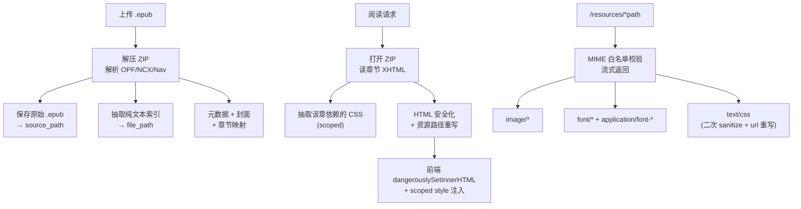

# EPUB 原生渲染支持

为 Lumina 添加 EPUB 上传与**原生 HTML 渲染**，目标不是"把 EPUB 塞进 TXT 的框架里"，而是**把 Lumina 升级为格式通用的阅读平台**——让 TXT 和 EPUB 在数据模型、API、前端渲染三层都平起平坐，并**最大程度保留 EPUB 原始的排版、样式、字体、图片、结构**。

---

## 设计理念

> 原则：**不替换、不降级**。TXT 保持现有行为零变化；EPUB 在相同的抽象下独立实现，保留源文件的视觉特性。

1. **数据模型格式化**：书籍增加 `format` 字段，不复用 `encoding` 做类型判别——`encoding` 回归其本义（文本编码）。
2. **统一 Position 模型**：书签、进度、搜索命中都用一个抽象的 `Position`；两种格式各自实现 resolve 逻辑，API 不泄漏格式差异给调用方。
3. **EPUB 原始视觉保留**：
   - 保留章节内嵌 `style` 属性（经属性白名单过滤）
   - 保留 `class` 属性 + 抽取 EPUB 内置 CSS，**scope 到章节容器**后注入，避免污染 App 样式
   - 保留字体文件，通过资源代理加载
   - 保留图片（包括 SVG），通过资源代理加载
   - 保留内部锚点和跨章节链接，前端拦截后作 SPA 跳转
4. **双通道存储**：原始 `.epub` 留下来用于 HTML 渲染 + 资源按需抽取；并行提取一份纯文本索引用于全书搜索（搜索逻辑对格式透明）。



---

## Proposed Changes

### 后端 · 数据模型

#### [MODIFY] [internal/database/migrations.go](internal/database/migrations.go)

```sql
-- 真正的格式字段（TXT | EPUB）——不再复用 encoding
ALTER TABLE books ADD COLUMN IF NOT EXISTS format VARCHAR(8) NOT NULL DEFAULT 'txt';

-- 原始源文件路径（TXT 为 NULL）
ALTER TABLE books ADD COLUMN IF NOT EXISTS source_path VARCHAR(512);

-- EPUB 章节在 ZIP 中的内部路径（TXT 为 NULL）
ALTER TABLE chapters ADD COLUMN IF NOT EXISTS content_ref VARCHAR(512);

-- EPUB 书签/进度的锚点与滚动比例——对 TXT 无意义，保持 NULL
ALTER TABLE bookmarks         ADD COLUMN IF NOT EXISTS anchor      VARCHAR(256);
ALTER TABLE bookmarks         ADD COLUMN IF NOT EXISTS scroll_pct  DOUBLE PRECISION;
ALTER TABLE reading_progress  ADD COLUMN IF NOT EXISTS anchor      VARCHAR(256);
ALTER TABLE reading_progress  ADD COLUMN IF NOT EXISTS scroll_pct  DOUBLE PRECISION;
```

| 字段 | TXT | EPUB |
|---|---|---|
| `books.format` | `"txt"` | `"epub"` |
| `books.encoding` | `"UTF-8"` / `"GBK"` / … | `"UTF-8"`（纯文本索引的编码，固定） |
| `books.file_path` | UTF-8 原文 | 抽取的纯文本索引（搜索用） |
| `books.source_path` | `NULL` | 原始 `.epub` |
| `chapters.start_pos/end_pos` | 原文字节偏移 | 纯文本索引字节偏移 |
| `chapters.content_ref` | `NULL` | `OEBPS/ch1.xhtml` |
| `bookmarks/progress.char_offset` | 段落级 rune 偏移 | 0（保留字段兼容） |
| `bookmarks/progress.anchor` | `NULL` | `#sec-12` 或元素 ID |
| `bookmarks/progress.scroll_pct` | `NULL` | 0..1 的章内滚动比例 |

> **兼容性**：已有 TXT 书签/进度的 `anchor` 和 `scroll_pct` 为 `NULL`，前端据此判断走哪条 resolve 路径。旧 API 返回结构不变（新字段为 optional）。

---

### 后端 · 统一 Position 抽象

#### [NEW] [internal/model/position.go](internal/model/position.go)

```go
package model

// Position 是格式无关的阅读位置。
//   - TXT: 使用 ChapterIdx + CharOffset
//   - EPUB: 使用 ChapterIdx + (Anchor OR ScrollPct)
// 两种格式下 ChapterIdx 都有意义；后三个字段按格式二选一使用。
type Position struct {
    ChapterIdx int      `json:"chapterIdx"`
    CharOffset int      `json:"charOffset,omitempty"` // TXT
    Anchor     *string  `json:"anchor,omitempty"`     // EPUB: 元素 id
    ScrollPct  *float64 `json:"scrollPct,omitempty"`  // EPUB: 章内滚动比例 0..1
}
```

#### [MODIFY] [internal/model/progress.go](internal/model/progress.go) / [internal/model/bookmark.go](internal/model/bookmark.go)

两个 model 各自新增 `Anchor *string` 和 `ScrollPct *float64` 字段（optional，不破坏现有 JSON 形状）。

---

### 后端 · EPUB 解析器

#### [NEW] [internal/service/epub_parser.go](internal/service/epub_parser.go)

```go
func ParseEPUB(data []byte) (*EPUBResult, error)

type EPUBResult struct {
    Title       string
    Author      string
    Description string
    Language    string
    Chapters    []EPUBChapter  // 按 spine 顺序
    CoverData   []byte
    CoverMIME   string
    PlainText   string         // 拼接纯文本（搜索索引）
    IsFixedLayout bool         // 漫画/绘本类 EPUB，v1 拒绝
}

type EPUBChapter struct {
    Title      string // 优先 NCX/Nav → <title> → <h1..h3> → "第 N 章"
    ContentRef string // OEBPS/ch1.xhtml
    StartPos   int    // PlainText 字节偏移
    EndPos     int
}
```

**解析流程**：

1. `archive/zip` 打开 → 读 `META-INF/container.xml` → 定位 `.opf`
2. 用 `encoding/xml` 解析 OPF：
   - `<metadata>` → `dc:title`、`dc:creator`、`dc:description`、`dc:language`
   - `<manifest>` → id → (href, media-type) 映射
   - `<spine>` → 按 itemref 顺序得到阅读文档列表
   - 检测 `<meta property="rendition:layout">` 是否为 `pre-paginated` → `IsFixedLayout`
3. **章节标题来源优先级**（保留目录结构）：
   - EPUB3：解析 `nav.xhtml` 的 `<nav epub:type="toc">` 链表
   - EPUB2：解析 `toc.ncx` 的 `<navMap>`
   - 回退：从 XHTML 内 `<title>` / `<h1>~<h3>` 提取
   - 最后：`"第 N 章"`
4. **封面提取优先级**：
   - `<meta name="cover" content="..."/>` → manifest item
   - manifest item 的 `properties="cover-image"`
   - `<guide><reference type="cover"/></guide>`
   - 第一张 spine 内的图像
5. **纯文本提取**：用 `golang.org/x/net/html` tokenizer 遍历每个 spine 文档，去掉标签取可见文本；保存每章在 PlainText 中的 `[start, end)`。

---

### 后端 · HTML/CSS 安全化（核心：最大程度保留效果）

#### [NEW] [internal/service/epub_sanitize.go](internal/service/epub_sanitize.go)

这是整个计划里最关键的模块——**决定"保留多少原始效果"**。采用"**命名空间隔离 + 黑名单删除 + 属性精细过滤**"的策略，而非粗暴白名单。

```go
// SanitizeChapterHTML 返回 (cleanedHTML, scopedCSS, err)
//   - cleanedHTML: 可直接渲染到 .epubContent 容器
//   - scopedCSS:   该章依赖的 CSS 经 selector scoping 后的字符串
func SanitizeChapterHTML(
    zipReader *zip.Reader,
    bookID int,
    contentRef string,
) (html string, css string, err error)
```

#### HTML 处理规则

**强删标签**（安全/无用）：
- `script`, `iframe`, `object`, `embed`, `form`, `input`, `textarea`, `button`
- `link`（经资源代理统一处理，不让 `<link rel="stylesheet">` 直接命中浏览器）
- `meta`, `head`, `html`, `body`（剥离外壳，保留 body 内容）

**保留标签**（极宽的白名单——接近全部排版相关标签）：
- 所有块级：`p, div, section, article, aside, header, footer, nav, main, blockquote, hr, pre`
- 所有标题：`h1~h6, hgroup`
- 所有内联：`span, em, strong, b, i, u, s, small, mark, sub, sup, cite, q, abbr, dfn, kbd, samp, var, code, time, ruby, rt, rp, bdi, bdo, wbr, br`
- 列表/表格：`ul, ol, li, dl, dt, dd, table, thead, tbody, tfoot, tr, th, td, caption, colgroup, col`
- 媒体/图形：`img, figure, figcaption, picture, source, svg, g, path, circle, rect, line, polyline, polygon, text, tspan, use, symbol, defs`
- 交互容器（降级为普通容器）：`details, summary`
- 链接：`a`

**属性规则**：
- 白名单基础属性：`class, id, lang, dir, title, alt, role, colspan, rowspan, headers, scope, datetime, cite, href, src, srcset, sizes, width, height, viewBox, xmlns, xmlns:xlink, preserveAspectRatio, d, fill, stroke, stroke-width, points, cx, cy, r, x, y, x1, y1, x2, y2, transform`
- **保留** `style` 属性（**关键**），但经 CSS 属性白名单过滤：允许 `color, background*, font*, text-*, line-height, margin*, padding*, border*, width, height, display, float, clear, vertical-align, letter-spacing, word-spacing, text-indent, white-space, list-style*, table-layout`；禁止 `position: fixed/sticky`、`z-index`、`@import`、`expression()`、以及任何 `url()` 指向外部 http(s) 的值
- **删除**所有事件属性（`on*`）
- **重写 href**：
  - 内部锚点 `href="#foo"` → `href="#ch{idx}-foo"`（加章节前缀防冲突）
  - 跨章节 `href="ch3.xhtml#sec"` → `href="#/chapter/3#ch3-sec"`（前端拦截解析）
  - 外部 `http(s)://` → 加 `target="_blank" rel="noopener noreferrer"`
  - `javascript:` / `data:` / `vbscript:` → 删除
- **重写 src/srcset/xlink:href**（资源路径）：`images/foo.png` → `/api/books/{bookID}/resources/{resolvedPath}`，其中 `resolvedPath` 基于 `contentRef` 的目录做相对路径解析
- **给 root 包裹**：最终 HTML 外层包一个 `<div class="epub-chapter" id="ch-{idx}">`，便于 CSS scoping

#### CSS 处理规则（**最大保留效果的关键**）

每章渲染时：

1. 扫描章节 XHTML 的 `<link rel="stylesheet" href="…">` 和 `<style>` 标签
2. 从 ZIP 读出对应 CSS 文件 + 合并 inline `<style>`
3. **CSS 安全化 + Scoping**：
   - 用一个轻量 CSS 解析器（`github.com/tdewolff/parse/v2/css` 或自实现 tokenizer）遍历规则
   - 每个 selector 前缀 `.epub-chapter ` → 限制作用域到当前章节容器
   - `body` / `html` 选择器重写为 `.epub-chapter`
   - 删除 `@import`
   - `@font-face` 保留，但 `src: url(...)` 重写为 `/api/books/{id}/resources/{path}`
   - 所有 `url()` 引用重写为资源代理地址
   - 删除含 `position: fixed/sticky`、`expression()`、`javascript:`、外链 `url()` 的声明
4. 返回给前端作为 `<style>` 字符串注入

**效果**：EPUB 的字体、行距、缩进、首字下沉、多栏布局、代码块背景色等原始样式全部保留，但被限制在 `.epub-chapter` 容器里，不会污染 Lumina 自身的 UI。

---

### 后端 · 资源代理

#### [NEW] 路由 `GET /api/books/:id/resources/*path`

注册在 [main.go](main.go)：

```go
authed.GET("/books/:id/resources/*path", handler.GetEPUBResource)
```

#### [NEW] `handler.GetEPUBResource`

1. 鉴权：`assertBookOwned(userID, bookID)`
2. 查 `source_path`，打开 ZIP
3. 规范化 `path`（防路径穿越：拒绝 `..`、绝对路径、`\`）
4. 查找 ZIP 条目
5. **MIME 白名单**（比原计划扩展）：
   - `image/*`（包含 svg）
   - `font/*`, `application/font-*`, `application/vnd.ms-fontobject`, `application/x-font-*`
   - `text/css`——**但需要经过 CSS sanitizer 二次处理**（url 重写、危险属性过滤），不能直接流给浏览器
6. 响应头：
   - `Content-Type`
   - `Cache-Control: private, max-age=86400`
   - `X-Content-Type-Options: nosniff`
7. 流式返回

---

### 后端 · 上传流程

#### [MODIFY] [internal/service/book_service.go](internal/service/book_service.go)

`CreateBook` 按扩展名分流：

```go
switch strings.ToLower(filepath.Ext(filename)) {
case ".txt", "":
    return createBookFromTXT(...)  // 现有逻辑
case ".epub":
    return createBookFromEPUB(...)
default:
    return nil, fmt.Errorf("不支持的文件格式: %s（仅支持 .txt / .epub）", ext)
}
```

`createBookFromEPUB` 流程：
1. `ParseEPUB(rawData)` → `EPUBResult`
2. 若 `IsFixedLayout` 为 true → 返回错误（v1 不支持）
3. 保存原始 `.epub` 到 `uploads/{userID}/` → `source_path`
4. 保存 `PlainText` 为 `.txt` → `file_path`
5. 写入 `books`：`format='epub'`，`encoding='UTF-8'`
6. 批插入 `chapters`（含 `content_ref`）
7. 如有封面调 `saveCoverFromBytes`
8. 初始化 `reading_progress`（`chapter_idx=0, char_offset=0, scroll_pct=0`）

#### [MODIFY] `bookColumns` / `scanBook`

增加 `format`、`source_path` 字段读取。

#### [MODIFY] `DeleteBook`

同时删除 `source_path` 指向的 `.epub` 文件。

---

### 后端 · 章节内容 API

#### [MODIFY] [internal/service/chapter_service.go](internal/service/chapter_service.go)

`ChapterContent` DTO 扩展：

```go
type ChapterContent struct {
    ChapterIdx int      `json:"chapterIdx"`
    Title      string   `json:"title"`
    Format     string   `json:"format"` // "txt" | "epub"
    CharCount  int      `json:"charCount"`

    // TXT 模式
    Paragraphs []string `json:"paragraphs,omitempty"`

    // EPUB 模式
    HTML       string   `json:"html,omitempty"`
    CSS        string   `json:"css,omitempty"`  // 已 scoped，可直接注入 <style>

    PrevIdx    *int     `json:"prevIdx,omitempty"`
    NextIdx    *int     `json:"nextIdx,omitempty"`
}
```

`GetChapterContent` 按 `books.format` 分支：
- `txt` → 现有逻辑
- `epub` → 打开 `source_path` ZIP → 读取 `content_ref` → `SanitizeChapterHTML` → 返回 `{format, html, css}`

---

### 后端 · 搜索的格式适配

#### [MODIFY] `SearchBook`

搜索本身**不改**——仍然在纯文本索引上做 substring match。但返回的 `SearchHit` 扩展：

```go
type SearchHit struct {
    ChapterIdx   int    `json:"chapterIdx"`
    ChapterTitle string `json:"chapterTitle"`
    // TXT: 段落级跳转
    ParagraphIdx int    `json:"paragraphIdx"`
    CharOffset   int    `json:"charOffset"`
    // EPUB: 命中序号，前端渲染 HTML 时通过客户端 TreeWalker 定位第 N 个匹配
    HitSeq       int    `json:"hitSeq,omitempty"`
    // 公共
    Preview                string `json:"preview"`
    PreviewHighlightStart  int    `json:"previewHighlightStart"`
    PreviewHighlightLength int    `json:"previewHighlightLength"`
}
```

**EPUB 搜索命中跳转方案**（解决"纯文本 char offset 无法映射到 HTML DOM"问题）：

- **v1 简化**：命中定位到章节粒度——点击命中 → 跳到该章 + 前端在客户端对渲染后的 HTML 做 `TreeWalker` 文本节点扫描，找到第 `hitSeq` 个匹配并 `scrollIntoView`，插入临时 `<mark>` 高亮。缺点：章内大量命中时扫描有开销；优点：零后端复杂度，精度够用。
- **v2 精确**：后端在 sanitize 阶段可选参数 `highlight=query`——在 HTML 文本节点按 query 匹配插入 `<mark class="search-hit" data-hit="N">`。v1 先不上，留扩展点。

**第一版实现 v1**。

---

### 后端 · 书签与进度的格式适配

#### [MODIFY] `progress_service.go` / `bookmark_service.go` / 对应 handler

API handler 层接受新字段 `anchor` 和 `scrollPct`（optional），service 层透传到 DB。
前端按 `book.format` 决定发送哪些字段。
现有 TXT 调用不传新字段，行为完全不变。

---

### 前端 · Reader 双模式渲染

#### [MODIFY] [web/src/pages/Reader/Reader.jsx](web/src/pages/Reader/Reader.jsx)

关键重构：**把 Position 解析、进度计算、滚动恢复抽成格式感知的 helper**，Reader 主体按 `chapter.format` 分支渲染。

```jsx
// chapter.format === 'txt' → 现有段落渲染 + paraRefs
// chapter.format === 'epub' → 单一容器 + dangerouslySetInnerHTML + scoped CSS

<div className={styles.body}>
  {chapter.format === 'epub' ? (
    <>
      {chapter.css && (
        <style data-epub-scope={`ch-${chapter.chapterIdx}`}>
          {chapter.css}
        </style>
      )}
      <div
        ref={epubContentRef}
        className={styles.epubContent}
        dangerouslySetInnerHTML={{ __html: chapter.html }}
      />
    </>
  ) : (
    chapter.paragraphs.map((p, i) => (
      <p key={i} ref={setParaRef(i)} className={styles.paragraph}>{p}</p>
    ))
  )}
</div>
```

**Position 解析 helper**（新增 [web/src/utils/position.js](web/src/utils/position.js)）：

```js
// 保存位置：根据 format 返回不同的 Position 对象
export function capturePosition(chapter, paraRefs, epubContentRef) { ... }

// 恢复位置：同上反向
export function restorePosition(chapter, position, paraRefs, epubContentRef) { ... }
```

**EPUB 模式下**：
- `capturePosition`: 计算 `scrollPct = (scrollY - container.top) / container.height`，同时记录视口上沿最近的带 `id` 元素作为 `anchor`（更稳定的定位点）
- `restorePosition`:
  1. 如果有 `anchor` → `document.getElementById(anchor).scrollIntoView()`
  2. 否则用 `scrollPct` 计算滚动位置
- 不依赖 `paraRefs`

**EPUB 链接拦截**：
- `epubContentRef` 上绑 `click` 事件
- `href="#ch3-foo"` → 本章内锚点，浏览器原生行为
- `href="#/chapter/3#..."` → `e.preventDefault()` + `loadChapter(3)` + 存 `pendingJumpRef`（含 anchor）
- 外链 → 放行 `target="_blank"`

**搜索跳转（EPUB）**：
- 切到目标章节后，等 chapter 加载完成
- `TreeWalker` 遍历 `epubContentRef` 文本节点匹配 query
- 对第 `hitSeq` 个命中临时插入 `<mark class="search-hit-temp">`、`scrollIntoView`、2 秒后移除

#### [MODIFY] [web/src/pages/Reader/Reader.module.css](web/src/pages/Reader/Reader.module.css)

新增 `.epubContent` 的 **基础样式兜底**（当 EPUB 自身 CSS 为空时使用）：

```css
.epubContent {
  /* 与阅读主题对齐的基础 token，被 EPUB 内部 CSS 覆盖优先级更高 */
  font-family: var(--font-reading);
  font-size: var(--reader-font-size);
  line-height: var(--reader-line-height);
  color: var(--text-main);
  --link-color: var(--accent);
}
.epubContent :global(.epub-chapter) p { margin: 0 0 0.8em; }
.epubContent :global(.epub-chapter) img { max-width: 100%; height: auto; }
.epubContent :global(.epub-chapter) a { color: var(--link-color); }
.epubContent :global(.epub-chapter) blockquote {
  border-left: 3px solid var(--accent);
  padding-left: 1em;
  color: var(--text-soft);
}
/* ...其他兜底样式 */
```

> 注：**故意不用 `!important`**，让 EPUB 原始 CSS 优先覆盖。用户自定义的字号/行距通过在 `.epubContent` 上用 CSS 变量暴露，EPUB 内部也能继承（`font-size: inherit` 的情况下）。

---

### 前端 · 上传区域

#### [MODIFY] [web/src/components/UploadZone/UploadZone.jsx](web/src/components/UploadZone/UploadZone.jsx)

```diff
- if (!file.name.toLowerCase().endsWith('.txt')) {
-   setError('目前仅支持 .txt 文件')
+ const ext = file.name.toLowerCase().split('.').pop()
+ if (!['txt', 'epub'].includes(ext)) {
+   setError('仅支持 .txt 和 .epub 文件')

- accept=".txt,text/plain"
+ accept=".txt,.epub,text/plain,application/epub+zip"

- '拖入 TXT，或点击选择'
+ '拖入 TXT / EPUB，或点击选择'
```

---

## 真正不受影响的部分

重新诚实地列：

- **TXT 流程全程零改动**：上传、阅读、搜索、书签、进度、编码自动识别。
- **现有前端组件**：`TopBar` / `SettingsPanel` / `BookmarkPanel` / `TOCDrawer` / `ProgressBar` / `ShortcutHelp` 全部无需改动——它们都基于 `chapter.chapterIdx / chapters[]` 工作，与渲染模式无关。
- **鉴权 / 路由 / Session**：无关。

**受影响但接口兼容**：
- 书签 / 进度 API：新增 optional 字段 `anchor` / `scrollPct`，TXT 请求不传即可。
- 搜索 API：新增 optional `hitSeq`，TXT 客户端忽略即可。

---

## 风险与开放问题

> [!NOTE]
> **CSS Scoping 的复杂度**：正确给 CSS 加 scope 需要处理 selector list（逗号分隔）、`@media` / `@supports` 嵌套、`:root` / `html` / `body` 替换。建议引入一个小型 CSS 解析库（如 `github.com/tdewolff/parse/v2/css`，依赖轻），比自己写正则稳。是否接受新增依赖？

> [!NOTE]
> **SVG 保留的安全性**：SVG 内嵌 `<script>` / `<foreignObject>` / `<use xlink:href>` 可以执行 JS 或加载外部资源。保留 SVG 的前提是**严格过滤这几类子元素和属性**。第一版策略：保留静态 SVG 的几何元素（`path/rect/circle/...`），删除 `script` / `foreignObject` / 指向外部的 `xlink:href`。

> [!NOTE]
> **`@font-face` 的字体文件**：保留原始字体会增加流量（EPUB 字体常常 1–5 MB）。是否接受？或给用户一个设置开关「使用原书字体 / 使用系统字体」？

> [!NOTE]
> **EPUB 搜索跳转精度**：v1 采用章级 + 客户端 TreeWalker 二次扫描，多次命中按序号区分。实际测试后如反馈不够精准，再上 v2（后端注入锚点）。

> [!NOTE]
> **Reflow vs Fixed Layout EPUB**：本计划只针对 **Reflowable EPUB**。Fixed Layout（漫画、图文绘本）需要完全不同的渲染策略（按页、保持 viewport），v1 不支持——检测到 `rendition:layout="pre-paginated"` 时上传直接拒绝并提示。

---

## 分阶段实施

建议按下面顺序推进，每阶段可独立验证、独立合并：

| 阶段 | 内容 | 可验证的里程碑 |
|---|---|---|
| **P1 基础** | 数据迁移、`ParseEPUB`、上传分流、`source_path` / `content_ref` 持久化、封面提取、Fixed Layout 拒绝 | 上传 EPUB 后书架显示正确书名/作者/封面；打开阅读器显示"加载中"不崩溃 |
| **P2 最小渲染** | 章节 HTML 返回（白名单严格版，**先不带 CSS**）、前端 `.epubContent` 基础样式、资源代理（仅 image） | 能读完一本带图 EPUB，段落层级、加粗斜体、图片正常 |
| **P3 原生效果** | CSS 抽取 + scoping、`@font-face` 支持、style 属性保留 + 过滤、资源代理扩展到 css/font | 复杂排版的 EPUB（技术书、诗集）视觉接近原书 |
| **P4 跳转完整性** | Position 抽象、书签/进度/搜索的 EPUB 路径、跨章节链接拦截 | 书签/进度/搜索跳转在 EPUB 上可用；关闭重开位置正确 |
| **P5 打磨** | Open Questions 决议、性能优化（大 EPUB 解析缓存） | 正式可发布 |

---

## Verification Plan

### Automated

```bash
go build ./...
go test ./...             # epub_parser / epub_sanitize 需单测
cd web && npm run build
```

单测重点：
- `ParseEPUB`：正常 EPUB、无 `nav.xhtml` 仅 `toc.ncx` 的 EPUB2、无目录回退、Fixed Layout 拒绝
- `SanitizeChapterHTML`：XSS 输入（`<script>`、`onclick`、`javascript:` href、SVG `<script>`、`expression()`）全部被拦掉；合法 `<style>` / class / `style=""` 保留
- CSS scoper：selector list、`@media`、`body` 替换、`url()` 重写、`@font-face` 保留

### Manual

1. 上传三种 EPUB（纯文本小说 / 带图技术书 / 诗集复杂排版），书名/作者/封面正确
2. 阅读器中加粗、斜体、标题层级、列表、引用块、图片、代码块、表格**视觉与原书接近**
3. 搜索 EPUB → 命中跳到正确章节，页面内 mark 高亮
4. 在 EPUB 不同位置加书签 → 关闭重开定位准确
5. 进度同步：读到一半关闭 → 重开在同一 scrollPct 或 anchor 位置
6. 跨章节链接（如脚注）→ 点击跳到正确章节和锚点
7. 外链 → 新窗口打开
8. 上传恶意构造的 EPUB（带 `<script>`、JS href、`<style>` 含 `position: fixed`）→ 前端无脚本执行、无布局污染
9. 上传 TXT → 现有行为完全一致
10. 三个主题（浅/深/墨）下 EPUB 排版连贯、链接色可见
